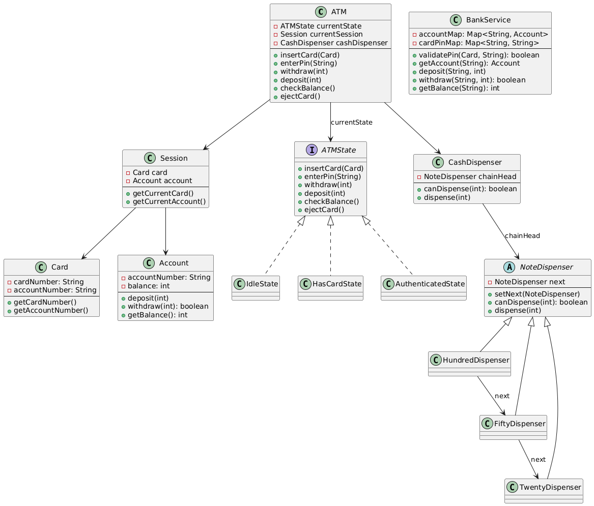

# Design ATM Machine (LLD)

> ⚠️ **Disclaimer**
>
> This project contains a complete and modular implementation of an ATM Machine LLD  
> using design patterns like State, Singleton, and Chain of Responsibility.
>
> ⚠️ Please note that **implementing this entire solution during a real-world interview (30–45 mins)**  
> is **not practically feasible**.
>
> ✅ In interviews, focus on:
> - Clarifying the problem and core requirements first
> - Designing key components and flows
> - Explaining patterns and trade-offs clearly
>
> This code is intended as a **comprehensive learning resource** and should be used to  
> understand concepts and structure — not as a strict interview template.
>
> 👉 Always adapt your approach based on the interviewer’s expectations and time constraints.

---
## ✅ ATM Machine LLD – Problem Statement
Design and implement an ATM (Automated Teller Machine) system that allows users to perform basic banking operations such as balance inquiry, cash withdrawal, and cash deposit, with secure authentication and proper cash management.

---
## ✅ ATM Machine LLD – Flow
🧭 ATM Flow (Based on UML & Use Case)
1. ATM in Idle State

2. User inserts card

3. System enters HasCardState

4. User enters PIN

5. System transitions to AuthenticatedState

6. User selects an operation
   - CHECK_BALANCE 
   - WITHDRAW_CASH 
   - DEPOSIT_CASH

7. If Withdrawal:
   - Authenticate balance 
   - Validate cash availability (using CashDispenser & NoteDispenser chain)
   - Dispense cash using 100/50/20 dispensers

8. If Deposit:
   - Add cash to the account 
   - Update machine total

9. If Balance Check:
   - Show current balance

10. Card is ejected → ATM returns to IdleState
---
## ✅ ATM Machine LLD – States
- Insert Card - IdleState -> HasCardState
- Enter Pin: 
  - If PIN incorrect: HasCardState -> IdleState
  - If PIN Correct: HasCardState -> AuthenticatedState
- Select operation: AuthenticatedState (same)
- Eject Card: Any -> IdleState

---
## ✅ ATM Machine LLD – Requirements

### 🔹 Functional Requirements
- 🏧 User should be able to **insert a card**
- 🔐 User must **enter PIN** for authentication
- 📋 User can **select operations**:
    - ✅ Check balance
    - 💰 Withdraw cash
    - 💵 Deposit cash
- 🧮 ATM must **validate account balance** before withdrawal
- 💸 ATM must **check internal cash availability** before dispensing
- 🏦 ATM should **dispense cash** using `100`, `50`, and `20` denominations via **NoteDispenser chain**
- 📉 ATM should **update account balance** after each operation
- ⏏️ User should be able to **eject the card** anytime
- 🔧 Admin can **refill cash** into the machine (future scope)

### 🔸 Non-Functional Requirements
- 🔒 Must be **thread-safe** (support concurrency)
- 🔁 **Extensible** to support new operations, states, denominations
- 🧠 Must follow **OOP best practices** (SRP, OCP, etc.)
- 💬 Code must have **clear comments** for readability
- 🧪 Each unit (ATM, BankService, Dispensers) must be **testable independently**
- 🧱 Must use **State Pattern**, **Singleton**, and **Chain of Responsibility**
---

## ✅ ATM Machine LLD – Assumptions

### 🔹 User & Card Assumptions

- 💳 Each card is **linked to one unique account**
- 🔐 PIN is pre-generated and mapped to a specific card
- 🆔 **Card number is unique** and required for authentication
- 🚫 Users **cannot change PIN** at the ATM (out of scope)

### 🔹 ATM Machine Assumptions

- 🧾 ATM only handles **one card at a time**
- 💵 Supports only three denominations: ₹100, ₹50, ₹20
- 🔁 Uses **Chain of Responsibility** for cash dispensing
- 🌐 ATM is always considered **online** (no network failure simulation)
- 🧍 Only one **ATM instance** exists – **Singleton pattern** is applied
- 🔄 **ATM state** (Idle, HasCard, Authenticated, etc.) is managed using **State Pattern**
- 🧮 Deposit accepts any amount (denominations not validated on input)

### 🔹 Bank System Assumptions

- 🏦 Card and Account details are managed by a **simple in-memory BankService**
- 🔗 A card is always linked to a valid and active bank account
- ✅ BankService is responsible for:
    - PIN validation
    - Balance checking
    - Deposit/withdraw operations

### 🔹 Concurrency Assumptions

- 🔐 Shared resources like:
    - ATM State
    - Bank Data (Accounts, Cards)
    - Dispenser units are **protected using thread-safe structures** and/or **synchronization**
---
## ✅ ATM Machine LLD – Actors

| 👤 **Actor**     | 🧠 **Responsibility**                                                                 |
|------------------|----------------------------------------------------------------------------------------|
| 🧍 User           | - Inserts card - Enters PIN - Performs operations like check balance, withdraw, deposit |
| 🏧 ATM Machine    | - Manages states (Idle, HasCard, Authenticated) - Delegates operations to bank & dispensers |
| 🔐 Card           | - Linked to a bank account - Used to authenticate via PIN                          |
| 🏦 BankService    | - Authenticates card & PIN - Checks balance - Updates balance on deposit/withdraw |
| 💸 CashDispenser  | - Verifies if sufficient cash is available - Coordinates cash dispensing via NoteDispensers |
| 💵 NoteDispensers | - Dispenses notes of ₹100, ₹50, ₹20 using Chain of Responsibility pattern             |
---
## ✅ ATM Machine LLD – Use Case Summary

| 🔍 **Use Case**            | 🧱 **Classes Involved**                                             | 🧠 **Responsibility**                                                                 |
|----------------------------|---------------------------------------------------------------------|----------------------------------------------------------------------------------------|
| Insert Card                | ATM, Card, IdleState → HasCardState                                | Detects card, transitions state                                                       |
| Enter PIN                  | ATM, BankService, HasCardState → AuthenticatedState                | Verifies PIN using BankService                                                        |
| Check Balance              | ATM, BankService, AuthenticatedState                               | Fetches and displays account balance                                                  |
| Withdraw Cash              | ATM, BankService, CashDispenser, NoteDispensers, AuthenticatedState| Validates balance, checks cash availability, and dispenses using 100/50/20 notes      |
| Deposit Cash               | ATM, BankService, AuthenticatedState                               | Accepts deposit, updates account balance                                              |
| Eject Card                 | ATM, Any State → IdleState                                         | Transitions machine back to IdleState and clears session                              |
| Dispense Cash (Internally)| CashDispenser, NoteDispensers (Chain of Responsibility)            | Dispenses requested amount via appropriate note combination                           |
---
## ✅ ATM Machine LLD – Design Patterns Used

### 🧱 1. State Pattern 🌀

- **Applied In:** ATM machine's operational states:
    - `IdleState`, `HasCardState`, `AuthenticatedState`
- **Purpose:** Allows dynamic behavior based on the ATM's current state
- **Benefit:** Cleaner state transitions and easier to add/remove states

### 🧱 2. Singleton Pattern 🔁

- **Applied In:** `ATM` class
- **Purpose:** Ensure only **one instance** of ATM exists
- **Benefit:** Centralized control of cash, state, and session

### 🧱 3. Chain of Responsibility Pattern 🔗

- **Applied In:** `NoteDispenser` classes (₹100 → ₹50 → ₹20)
- **Purpose:** Distribute cash dispensing responsibility across note handlers
- **Benefit:** Easily extendable for new denominations (e.g., ₹2000, ₹10)

### 🧱 4. Strategy Pattern (Optional) 🎮

- **Can Be Applied In:** Operation execution (Withdraw, Deposit, CheckBalance)
- **Purpose:** Encapsulate logic for each operation as interchangeable strategy
- **Benefit:** Makes operations modular and decoupled from ATM logic

## 🧱 5. Factory Pattern (Optional) 🏭

- **Can Be Applied In:** Creating state instances or note dispensers
- **Purpose:** Abstract and manage object creation logic
- **Benefit:** Cleaner setup and test-friendly object construction
---
## ✅ ATM Machine LLD –  Core Entities

### 🏧 1. `ATM` (Singleton)
- 💡 **Purpose:** Central system that handles states, sessions, and operations.
- 🔧 **Key Fields:**
    - `ATMState currentState` – current operational state
    - `Session session` – current user session (card + account)
    - `CashDispenser dispenser` – manages note dispensing

### 🌀 2. `ATMState` (Interface) + Concrete States
- 💡 **Purpose:** Defines how ATM behaves in each state.
- 🔧 **States:**
    - `IdleState` – waiting for card
    - `HasCardState` – card inserted, awaiting PIN
    - `AuthenticatedState` – user authenticated, can do operations
- 🧠 **Implements:**
    - `insertCard()`, `enterPin()`, `withdraw()`, `deposit()`, `checkBalance()`, `ejectCard()`

### 💳 3. `Card`
- 💡 **Purpose:** Represents a physical debit/ATM card.
- 🔧 **Fields:**
    - `String cardNumber`
    - `String linkedAccountNumber`

### 🏦 4. `BankService`
- 💡 **Purpose:** Simulates backend – validates PIN, handles accounts.
- 🔧 **Responsibilities:**
    - Authenticate PIN
    - Fetch/update balance
    - Deposit/withdraw money

### 👤 5. `Account`
- 💡 **Purpose:** Represents a user’s bank account.
- 🔧 **Fields:**
    - `String accountNumber`
    - `int balance`
- 🔄 **Methods:**
    - `deposit()`, `withdraw()`, `getBalance()`

### 🔐 6. `Session`
- 💡 **Purpose:** Holds temporary info during a single user session.
- 🔧 **Fields:**
    - `Card currentCard`
    - `Account currentAccount`

### 💸 7. `CashDispenser`
- 💡 **Purpose:** Coordinates note distribution using a chain.
- 🔧 **Field:**
    - `NoteDispenser chainHead`
- 🔄 **Method:**
    - `dispense(int amount)`

### 💵 8. `NoteDispenser` (Abstract)
- 💡 **Purpose:** Abstract class for each denomination handler.
- 🔧 **Subclasses:**
    - `HundredDispenser`, `FiftyDispenser`, `TwentyDispenser`
- 🧠 **Implements:**
    - `canDispense(int amount)`, `dispense(int amount)`
- 💡 **Pattern Used:** Chain of Responsibility

### 🏭 9. `DispenserFactory` (Optional)
- 💡 **Purpose:** Creates and links note dispensers in proper order.
- 🔧 **Method:**
    - `createChain()` → ₹100 → ₹50 → ₹20
---

---
## ✅ Assumptions -- which I made while writing this code 🧠
- Only one ATM is present (Singleton pattern used).
- Only ₹100, ₹50, and ₹20 notes are supported (configurable).
- User must insert a valid card before interacting.
- PIN validation is handled by a mock `BankService`.
- Session ends after user ejects card.
- No hardware-level exception handling (e.g. card stuck).
- No support for network/server failure in `BankService`.
- Fixed number of notes for each denomination (set inside Dispenser).
- ATM handles one user at a time (no thread pool or session queue).
- No GUI - only console simulation is used.

---
## ⚖️ Trade-offs Made
1. **Singleton Pattern for ATM**  
   ✅ Easy to manage one ATM instance  
   ❌ Not scalable for multiple ATMs (can’t simulate multiple ATMs per branch)

2. **State Pattern**  
   ✅ Clean, modular behavior per state  
   ❌ Slight increase in complexity and number of classes

3. **Chain of Responsibility for Cash Dispensing**  
   ✅ Very extensible (can add ₹10, ₹200, ₹500 easily)  
   ❌ More setup code for small systems

4. **Thread Safety with synchronized methods**  
   ✅ Basic concurrency protection on shared account balance  
   ❌ Doesn’t handle full multi-user simulation (no session locks, no concurrent sessions)

5. **In-memory Data Only (BankService)**  
   ✅ Fast, testable, easy to mock  
   ❌ Not persistent — everything resets on restart

6. **Hardcoded PIN and Account Setup**  
   ✅ Simple for demo and interviews  
   ❌ Not secure / scalable in real-world usage
---
## 🔭 Scope for improvement 🚀
- ✅ Support multiple users using session/thread-based locking
- 🔐 Add session timeout / login attempt limits
- 💸 Add more denominations (₹200, ₹500, ₹10)
- 💾 Store data in a database instead of in-memory maps
- 📲 Add mobile OTP for two-factor authentication
- 📈 Add transaction history tracking (e.g., Mini Statement)
- ⚠️ Handle failure cases: power loss, network failure, dispenser jam
- 🧪 Add unit tests for state transitions and dispenser logic
- 📱 Add a UI or web-based frontend for ATM interaction
- 🏦 Support multiple ATMs using Factory + Singleton-per-location pattern
