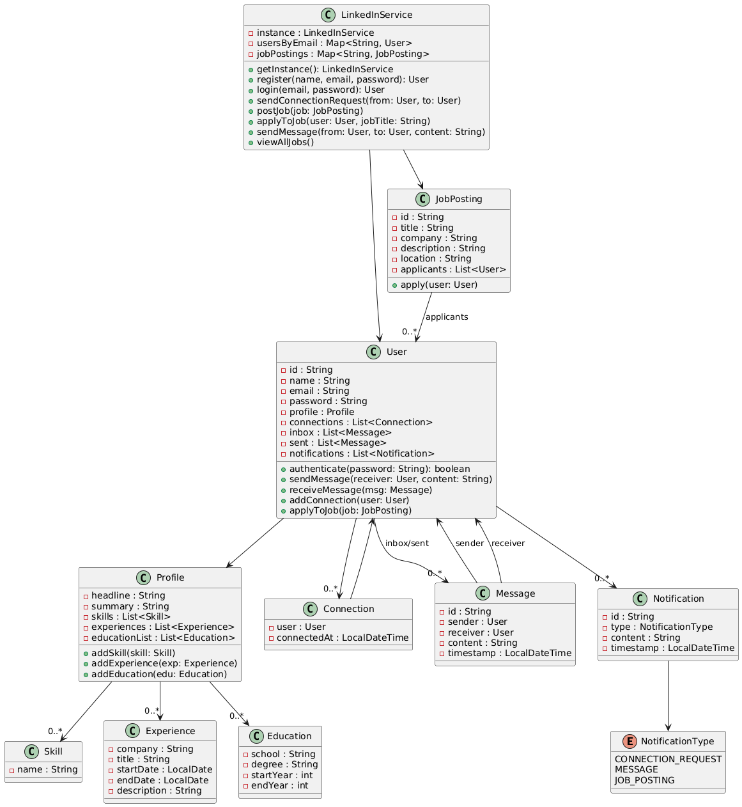

# Design LinkedIn (LLD)

## 🧠 Problem Statement
Design and implement a LinkedIn-like professional networking platform that allows users to create profiles, connect with others, post jobs, send messages, and receive notifications.

---
## ✅ Step 1: Flow (User Journey) 👥➡️🧑‍💼
1. User signs up or logs in with credentials.
2. User creates or updates profile with skills, education, experience.
3. User sends or receives connection requests from other users.
4. User can post a job or apply to existing jobs.
5. User can send and receive messages (inbox & sent items).
6. User receives notifications for:
    - Connection requests
    - Messages
    - Job updates

---
## ✅ Step 2: Requirements 📋
### 🎯 Core Functional Requirements:
- User registration, login, and profile setup
- Create/update personal profile (skills, experience, education)
- Connect with other users (request/accept)
- Send and receive messages
- Post job openings, view jobs, and apply to them
- Notification system for messages, job alerts, and connection events

### 🔒 Non-Functional Requirements:
- Thread safety (multiple users interacting concurrently)
- Scalability (millions of users, messages, jobs)
- Extensibility (easy to plug in search, endorsements, etc.)
---
## ✅ Step 3: Assumptions 🤔
- Email is unique for each user and used for login
- Notifications are stored in-memory for now (can be persisted later)
- Job postings are only visible within the system (no external APIs)
- Messages are simple (text only, no attachments)
- A user must be registered to send/receive messages or apply to jobs
- No recommendation engine included (like people/jobs you may know)
- Timestamps are assumed to be in UTC
- All data is managed in memory (Map-based repositories)
---
## ✅ Step 4: Actors 🎭
### 👥 User
- Sign up, login, update profile
- Send/accept connection requests
- Post and apply to jobs
- Send/receive messages
- Receive notifications

### 🧑‍💼 LinkedInService (System Controller)
- Manages users, connections, jobs, messages, and notifications

### 📢 Notification System
- Generates and stores notifications for users

### 💼 JobPosting
- Created and managed by users

### 📩 Messaging System
- Enables communication between users
---
## ✅ Step 5: Use Case Summary 📌
### 🧑‍💼 User Use Cases:
- Register and log in to the system
- Create, update, and view profile
- Add experience, education, and skills
- Send and accept connection requests
- View list of connections
- Send and receive messages
- Post a job
- Apply to a job
- View applied jobs
- View inbox and sent messages
- View all notifications

### 🧠 System (LinkedInService) Use Cases:
- Register users and authenticate login
- Manage job postings (create, search, apply)
- Handle connection requests and relationship mapping
- Send and route messages to inbox/sent
- Generate notifications for each event

### 💼 JobPosting Use Cases:
- Created by a user (poster)
- Visible to other users
- Accepts multiple applicants
- Returns applied user list

### 📩 Notification Use Cases:
- Triggered on:
    - Connection Request
    - Job Application
    - Message sent
- Stored in each user’s notification list

### 📦 Profile Use Cases:
- Tracks user’s skills, experience, education
- Editable independently
---
## ✅ Step 6: Design Patterns 🎯
### 1️⃣ Singleton Pattern – `LinkedInService`
- Ensures only one instance of the core service managing the platform.
- Centralized user/job/notification management.
- Used via: `LinkedInService.getInstance()`.

### 2️⃣ Factory Method (Potential Extension)
- Could be used to create different types of `Notification` or `Message` objects.
- Easily extendable if you add richer types like job alerts or group messages.

### 3️⃣ Observer Pattern (Conceptual - Notification System)
- Users can be “notified” when:
    - They receive a message
    - A job is posted or applied to
    - A connection is requested
- Each event **triggers a Notification**, similar to an observer’s `onNotify()`.

### 4️⃣ Builder Pattern (Optional Extension - for `Profile`)
- Profiles have complex data (skills, education, experiences)
- A fluent `ProfileBuilder` could simplify profile construction

### 5️⃣ Strategy Pattern (Extendable for Searching)
- Future search (by skill, location, keyword) could use interchangeable search strategies
- Decouples search logic from core system
---
## ✅ Step 7: Core Entities 📦

### 1️⃣ User
- Represents an individual on the platform
- Attributes: id, name, email, password, profile
- Relationships:
    - Has many: connections, messages (inbox/sent), notifications

### 2️⃣ Profile
- Stores user’s professional information
- Attributes:
    - Headline, Summary
    - List<Experience>, List<Skill>, List<Education>

### 3️⃣ Connection
- Represents a relationship between two users
- Attributes: user (target), timestamp

### 4️⃣ Experience
- A professional role or job experience
- Attributes: company, title, start/end dates, description

### 5️⃣ Skill
- Represents a single skill (e.g., Java, SQL)
- Attribute: name (String)

### 6️⃣ JobPosting
- Created by users (companies)
- Attributes:
    - id, title, company, description, location, applicants list

### 7️⃣ Message
- Represents a chat/message between users
- Attributes:
    - id, sender, receiver, content, timestamp

### 8️⃣ Notification
- A system-generated alert for a user
- Attributes:
    - id, user, type (enum), content, timestamp

### 9️⃣ NotificationType (Enum)
- Types of notifications:
    - CONNECTION_REQUEST
    - MESSAGE
    - JOB_POSTING

### 🔟 LinkedInService
- The core system manager (Singleton)
- Manages:
    - Users, JobPostings, Notifications
    - Signup/login
    - Send connection requests, messages, job applications

---
## ✅ Step 8: Code Implementation Plan (in Java) 🧠
> ⚙️ Note: We'll focus on structure, not writing entire implementations. Each class will contain fields + method stubs (with comments).
### 📍 Order to Implement:
1. Enum: `NotificationType`
2. Models: `User`, `Profile`, `Experience`, `Skill`, `Education`, `Connection`
3. Communication: `Message`, `Notification`
4. Job Posting: `JobPosting`
5. Service Layer: `LinkedInService` (Singleton)
6. Repositories (if any): In-memory maps
7. Sample `Main.java`: simulate user actions
---
## ✅ Step 9: Trade-offs ⚖️
### 🧠 Design Trade-offs Made

1. **In-Memory Storage (Map-based Repositories)**
    - ✅ Simpler for demonstration & testing
    - ❌ Not persistent (data lost on restart)
    - ⚠️ Not suitable for production

2. **No Thread-Safety**
    - ✅ Avoids locking complexity for learning
    - ❌ Unsafe if accessed concurrently
    - 💡 Can be improved with `synchronized` methods or `ConcurrentHashMap`

3. **Flat Message & Notification Models**
    - ✅ Easy to implement & reason about
    - ❌ Doesn't support group chats, threads, or rich content

4. **Single `LinkedInService` (God Class)**
    - ✅ Central control of all system logic
    - ❌ Violates SRP (Single Responsibility Principle)
    - 💡 Could split into UserService, JobService, MessageService later

5. **Connection is Mutual**
    - ✅ Simulates accepted connection immediately
    - ❌ No intermediate "pending" or "rejected" state
    - 💡 Could add a ConnectionRequest model with status
---
## ✅ Step 10: Scope of Improvements 🚀
### 🛠️ Features to Add for Real-World Readiness

1. **Thread Safety & Concurrency Handling**
    - Use `ConcurrentHashMap` and synchronization for shared resources
    - Add thread-safe message queues for high-traffic features

2. **Connection Request Workflow**
    - Add a `ConnectionRequest` class with `PENDING`, `ACCEPTED`, `REJECTED` states
    - Allow users to accept or decline requests explicitly

3. **Modular Services**
    - Break down `LinkedInService` into:
        - `UserService`
        - `JobService`
        - `MessageService`
        - `NotificationService`
    - Each should handle its domain logic

4. **Persistence Layer**
    - Replace in-memory maps with a proper DB layer (JPA, JDBC, NoSQL, etc.)
    - Add repository interfaces and implement basic CRUD operations

5. **Advanced Messaging**
    - Add support for:
        - Group chats
        - Attachments
        - Read receipts
        - Threads (like LinkedIn messages)

6. **Job Recommendations**
    - Add search and filtering logic
    - Use strategies or rule-based systems for suggestions

7. **Event-Driven Notification System**
    - Use Observer/EventBus/EventQueue pattern for async notifications

8. **Security**
    - Add hashed passwords (e.g., BCrypt)
    - Token-based login/session management
    - Role-based access control (admin vs user)

9. **Unit Tests**
    - Add JUnit tests for each service
    - Validate user registration, connection, message sending, etc.

10. **API & UI Layer**
- Expose as RESTful APIs
- Build a front-end in React/Angular to interact with this system

