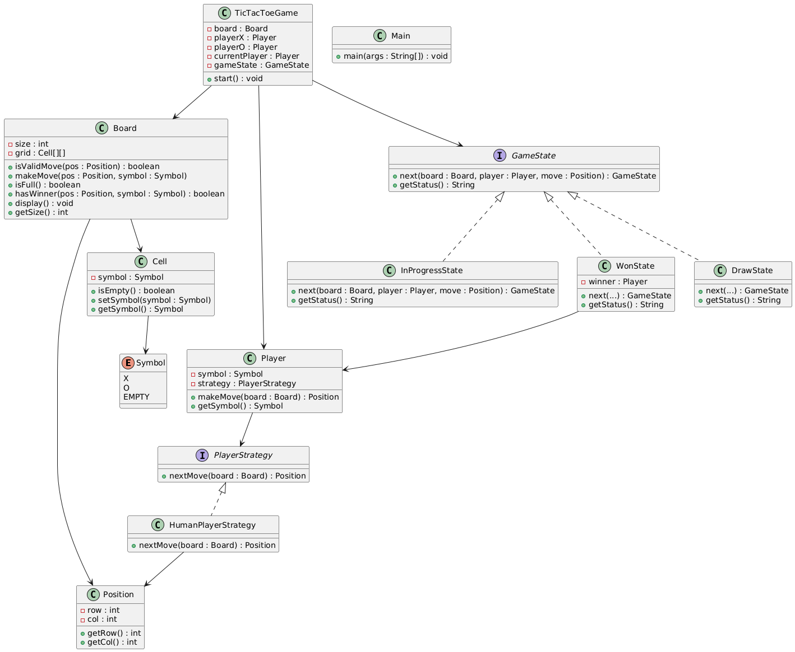

# 🎲 Design Tic Tac Toe Game (LLD)

> ⚠️ **Disclaimer**
>
> This project is a detailed implementation of a Tic Tac Toe system designed to demonstrate clean Low-Level Design (LLD) using object-oriented principles and design patterns.
>
> In a real-world system design or coding interview (typically 30–45 mins), implementing this **entire structure** is **not expected** or feasible.
>
> The goal should be to:
> - Clarify requirements early
> - Focus on class responsibilities, relationships, and key interactions
> - Implement only the most **critical parts** (e.g., Board logic, Player abstraction)
> - Show **design patterns** and **extensibility** where needed
>
> This repository is meant to serve as a **reference or learning resource** — not as a time-accurate interview solution.

## 🧠 Problem Statement
Design and implement a Tic Tac Toe ticTacToeGame that allows two players to play on a NxN board, alternating turns, and determines the winner or a draw.

---
## ✅ Step 1: Flow 🎮

1. Initialize a NxN board
2. Assign players (X and O) with strategies
3. Start game loop:
    - Display board
    - Current player makes a move
    - Check if the move leads to a win or draw
    - Switch turns
4. Announce the result:
    - X wins
    - O wins
    - Draw
---
## ✅Step-2: Requirements 💡

### 🎮 Functional Requirements
- Support **NxN grid** (configurable size)
- Allow **two players** to play (Player X and Player O)
- Support **human player strategy** (user input via console)
- Alternate turns between players
- Prevent invalid moves (e.g., already occupied cell)
- Determine and display:
    - Win for X or O
    - Draw (when board is full and no winner)
- Display board after each move
- Allow multiple game states (in progress, won, draw)

### 💡 Non-Functional Requirements
- Use **Object-Oriented Design**
- Follow **Open/Closed principle** to support AI strategy later
- Design must be **extensible and maintainable**
- Apply relevant **design patterns** (e.g., Strategy, State)
---
## ✅ Step 3: Assumptions 🤔
- Game board is square (N x N), value of N is configurable (e.g., 3x3, 4x4)
- Only two players: one uses symbol `X`, the other uses `O`
- All moves are turn-based and alternate between players
- Players are human (input via console); AI strategies can be added later
- Input is assumed to be valid integers within board range
- Game ends immediately when a win or draw is detected
- One move per player per turn
- No undo/redo feature implemented
- Console-based application (no GUI)
- Game starts immediately after initialization
---
## ✅ Step 4: Actors 🎭
### 🎮 Player (X & O)
- Takes turns to play on the board
- Uses a strategy to decide moves (e.g., human input)

### 🧠 PlayerStrategy (Interface)
- Provides a method to get the next move
- Implemented by HumanPlayerStrategy (can be extended for AI)

### 🎲 Game Engine (TicTacToeGame)
- Manages players, board, and the flow of the game
- Invokes strategies, checks win conditions, and switches players

### 📋 Board
- Represents the N x N grid
- Validates moves
- Updates the grid with player symbols
- Checks for win/draw state

### 🧩 GameContext / GameState
- Represents the current game state
- Switches between InProgress, Win, Draw using the **State pattern**

---
## ✅ Step 5: Use Case Summary 📜
### 🎮 Start Game
- User initializes the game with board size and player strategies.
- Board is created with all cells empty.

### 🔁 Take Turn
- Current player makes a move using their strategy.
- System validates the move and updates the board.
- Board is displayed after each move.

### 🧠 Check Game Status
- After each move:
    - Check if current player has won.
    - Check if the game is a draw.
    - If neither, switch turn to the other player.

### 🏁 End Game
- If a player wins, announce the winner (X or O).
- If board is full and no winner, declare a draw.

### ♻️ Replay (Optional)
- Optionally, ask if players want to restart the game (not implemented in base version).
---
## ✅ Step 6: Design Patterns Used 🎨
### 1. Strategy Pattern 🧠
- Used for defining how a player decides their move.
- `PlayerStrategy` interface is implemented by `HumanPlayerStrategy`.
- Allows easily plugging in an `AIPlayerStrategy` in the future.

### 2. State Pattern 🎯
- Used to represent and manage different game states:
    - `InProgressState`
    - `WonState`
    - `DrawState`
- Helps in cleanly handling transitions and behavior based on state.

### 3. Singleton Pattern 👑
- Optional: Can be applied to `TicTacToeGame` if only one game should run at a time.

### 4. Factory Pattern 🏭 (Optional)
- Could be used to create players or board configurations if required later.

### 5. Open/Closed Principle 🧩
- Code is open to new features (e.g., new strategies, board types) but closed to modification of core logic.
---
## ✅ Step 7: Core Entities 🧱
### 1. 🧩 `TicTacToeGame`
- Manages the game loop, board, players, and game state
- Starts and ends the game

### 2. 📋 `Board`
- Represents NxN grid of cells
- Responsible for:
    - Placing moves
    - Validating cells
    - Checking win or draw conditions

### 3. ⬜ `Cell`
- Represents a single cell on the board
- Holds the value (X, O, or empty)

### 4. 🎮 `Player`
- Contains:
    - Player symbol (X or O)
    - Strategy (human or AI)
- Delegates move decision to its strategy

### 5. 🧠 `PlayerStrategy` (Interface)
- Defines method `Position nextMove(Board board)`
- Implemented by:
    - `HumanPlayerStrategy`

### 6. 🧠 `GameState` (Interface)
- Represents state of the game (InProgress, Won, Draw)
- Method: `GameState next(Board board, Player currentPlayer)`

### 7. 📍 `Position`
- Simple class for cell coordinates: (row, col)

### 8. 🧠 Concrete Game States:
- `InProgressState`
- `WonState`
- `DrawState`

### 9. 🎯 `Symbol` (Enum)
- `X`, `O`, `EMPTY` — represents cell value

---
## ✅ Step 8: Code Implementation Summary 🧑‍💻

#### 1. `Symbol.java` (Enum)
- Represents values each cell can hold: `X`, `O`, or `EMPTY`.

#### 2. `Position.java`
- Value object to store board coordinates (row and column).

#### 3. `Cell.java`
- Represents each board cell.
- Stores its `Symbol` and checks if it's empty.

#### 4. `Board.java`
- Manages the NxN grid.
- Validates and applies moves, checks for win/draw, displays board.

#### 5. `PlayerStrategy.java` (Interface)
- Defines how a player makes a move.
- Allows extensibility for AI or other strategies.

#### 6. `HumanPlayerStrategy.java`
- Gets user input for next move using the console.

#### 7. `Player.java`
- Holds the player’s `Symbol` and strategy.
- Calls strategy to make a move.

#### 8. `GameState.java` (Interface)
- Defines how game state transitions after each move.
- Helps in clean state management.

#### 9. `InProgressState.java`
- Main state during the game.
- Transitions to `WonState` or `DrawState` when conditions are met.

#### 10. `WonState.java`
- Represents game won by a player.
- Holds and displays the winner.

#### 11. `DrawState.java`
- Final state when no more moves are left and no winner.

#### 12. `TicTacToeGame.java`
- Orchestrates the whole game:
    - Manages turns, players, board, and state transitions.

#### 13. `Main.java`
- Entry point of the app.
- Takes board size input and starts the game loop.

---
## ✅ Step 9: Trade-offs ⚖️
1. **Console-Based Game**
    - ✅ Easier to implement and test logic
    - ❌ No GUI (Not suitable for real players or production)

2. **Only Human Players**
    - ✅ Keeps design simple using `HumanPlayerStrategy`
    - ❌ No bot/AI logic yet (could use Minimax later)

3. **Sequential Play (No Concurrency)**
    - ✅ Turn-by-turn makes state tracking simpler
    - ❌ No real-time interaction/multithreading for remote play

4. **Immediate Win Check After Every Move**
    - ✅ Efficient — only checks affected row/col/diagonals
    - ❌ Could get complex for larger board sizes (but acceptable for NxN < 10)

5. **State Pattern for GameStatus**
    - ✅ Extensible for future states like "Paused"
    - ❌ Slight overkill for basic 3-state flow, but useful in interviews

6. **Input Not Fully Validated**
    - ✅ Simplifies flow
    - ❌ Could break if user enters letters or out-of-bound numbers (can be fixed)

---
## ✅ Step 10: Scope of Improvements 🛠️

1. 🤖 Add AI Strategy
    - Implement `AIPlayerStrategy` using Minimax or Random AI
    - Compete against computer instead of two human players

2. 🎨 GUI Integration
    - Build a front-end using JavaFX or Swing for better user interaction
    - Show clickable grid instead of console inputs

3. 🌐 Multiplayer Over Network
    - Add server-client support to allow remote players
    - Use sockets or WebSockets for real-time moves

4. ♻️ Replay Feature
    - Allow saving and replaying past games step-by-step
    - Useful for debugging and analysis

5. 📊 Game Stats & Leaderboard
    - Track player wins, losses, draws
    - Display a leaderboard or player profiles

6. 🧪 Robust Input Validation
    - Handle invalid inputs (e.g., text instead of numbers)
    - Provide retry mechanism and error feedback

7. 📱 Mobile Version (Future)
    - Port game logic to Android/iOS using Flutter or native SDKs

8. 🧩 Board Abstraction
    - Support different board types (e.g., Hexagonal, Connect Four) using inheritance

9. 🔄 Undo/Redo Functionality
    - Store game history stack for reversing moves

10. 🧼 Clean Separation of Concerns
    - Split classes into separate packages: model, strategy, state, game
    - Prepare for Spring Boot or REST API version if needed
